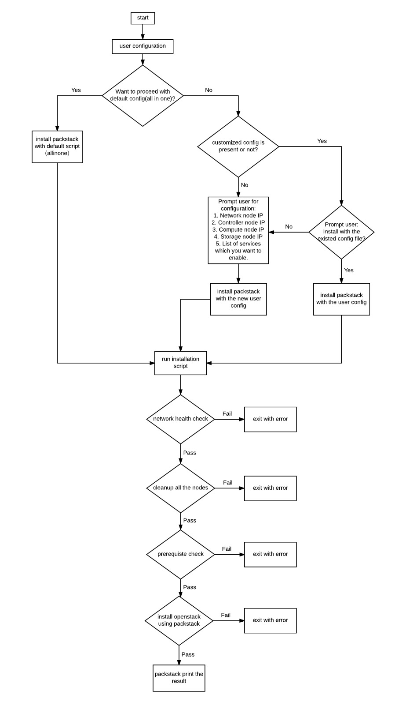

# OpenStack Auto-deployment Tool

### Abstract
OpenStack is a cloud operating system that controls large pools of compute, storage and networking resources throughout a datacenter, all managed through a dashboard that gives administrators control while empowering their users to provision resources through a web interface. With the increasing demand of the cloud services, the stakeholders need to be able to get the system up and running quickly without having to go through the intricacies of configuring the environment. Design and construct Open Stack on a stick. An automated installation and setup of the environment is something that might come handy when training needs to be provided to the stakeholders as well as when the business is growing rapidly.
  
Project is to construct scripts and related software libraries such that when a USB drive is inserted into a VT capable x86 machine, the scripts will lead the user through the steps to setup a basic Open Stack cloud. Initially the constructed cloud would pick a limited set of Open Stack modules but the scripts would have placeholders to add additional modules as part of the configuration script.
  
The setup can be done either on a single physical node or across multiple nodes in a cloud computing cluster by distributing the OpenStack components and services across them.
  
Come up with your own architecture to build the cloud. Record the time it takes for the manual setup and how much you are able to reduce it.
Your scripts should be able to handle the problems that arise during the setup. Pick an application as use case for the comparison on all three setups.
  
The team has to setup a single node environment, in which the OpenStack services will be installed by spinning different virtual machines for each of the core OpenStack components viz. controller node, computer node and network node.
  
Also, they need to setup a multi-node setup, where the controller, network and compute nodes are on different physical machines and the appliance helps set up one controller, one network and as many number of compute nodes as required. All this is done with minimal user input and with good network connectivity.
  
The team must develop all schedules, test plans and other studies as needed to be able to provide an assessment, including documenting any information that the team concludes is unknown or uncertain based on the information that the team has been provided.

### Flow Chart

